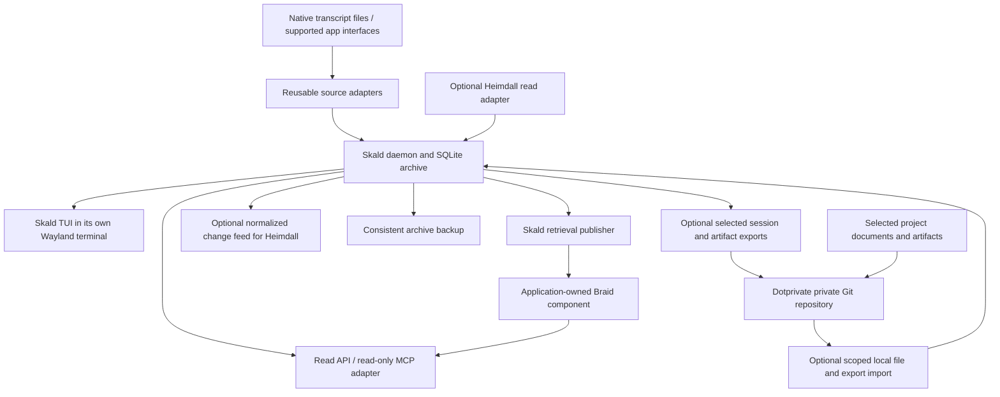

# Skald implementation plan

Originally reviewed 2026-09-09; revised 2026-09-10 for the Skald project.
Status: implementation reference. Delivery progress and verified behavior belong
in [STATUS.md](STATUS.md); planned features below are not claims of completion.
This document now lives in Skald's own project, alongside the TUI design studies.

Companion document: [Heimdall design amendment](SKALD-HEIMDALL-AMENDMENT.md).
The two documents share the session-record contract defined in §4 below. The
amendment explains how Heimdall would consume it without depending on Skald.

## 0. Naming and review decisions (2026-09-10)

The product and executable are **Skald** and `skald`; the Go module path is
`github.com/algorhythmic/skald`, matching the published repository so that
Heimdall can depend on it by tagged version.
The public package names remain `sessionrecord` and `sessioncapture`: they name
the shared domain, not the product. Configuration uses
`$XDG_CONFIG_HOME/skald`, durable state `$XDG_DATA_HOME/skald`, runtime socket
`$XDG_RUNTIME_DIR/skald/skald.sock`, and disposable indexes `$XDG_CACHE_HOME/skald`.
No legacy installation or database exists here, so there is no rename migration.

Reviewed design studies: [project/session overview](skald-window.html) and
[transcript reader](skald-transcript.html). Retain the warm monochrome terminal,
project tree, expandable recap/recent content, and separate transcript view.
These are synthetic design fixtures, not live application observations.

Review corrections carried into implementation:

- Keep conversation activity, surface availability and description freshness
  separate. An old transcript says neither “ended” nor “waiting on you” without
  native evidence. Mockup status labels must name their fixture evidence.
- Show the current selected excerpt before an older recap when a later assistant
  response exists; keep recap history and a visible newer-activity marker.
- Collapse tool details by default; preserve their source records. Recap placement
  follows source order and retains unknown coverage. Escape terminal controls.
- Wide views show row metadata alongside content; narrow views wrap metadata
  below titles and retain selection, grouping and transcript navigation.
- Capability labels distinguish fixture-tested parsing from verified live desktop
  collection. Missing Herdr, Heimdall or Braid must not imply failure of browsing.

L0 started 2026-09-10 in the Skald module and is in progress, not release-complete.
Publish its capture package and fixtures from Skald and pin the release in Heimdall
S1; hook installation and blocked-state signals remain Heimdall-owned.
Start with L0: a pinned Go module, shared identity/envelope contract, bounded
caller-checkpoint capture, capability reports, synthetic conformance fixtures and
archive DDL. Verify the foundation before the L1 daemon and durable collection.
The Heimdall amendment was adopted as design on 2026-09-10 with digest-only
events and purgeable evidence text. This plan does not implement Heimdall S1 or
change its schema or accepted task state. L1–L6 keep their own acceptance gates.

Implementation update: the archive daemon, TUI and selected-root connection flow now run. See
[archive setup](docs/ARCHIVE-SETUP.md) and [status](STATUS.md) for verified
commands, the 100-session measurement, and remaining release gates. The delivery
table remains the complete intended scope, not a claim that every gate is passed.

## 1. Outcome and decisions

Skald preserves accessible conversation records from agent tools and native
apps, shows what concurrent sessions are doing, and supplies attributable context
to agent consumers. Its first human interface is a dedicated terminal window on
Wayland, grouped by project, Herdr Space, or a user-defined session group.

The implementation must satisfy these decisions:

1. **Independent operation.** Skald collects, stores, displays and retrieves
   session information with Heimdall absent. Heimdall retains its own direct
   collection path when Skald is absent. Neither opens the other's database.
2. **Shared parsing, separate retention.** Provider parsing produces reusable
   normalized records. Each application decides which records to retain and how
   to interpret them. Repeated storage serving independent products is acceptable.
3. **Passive collection first.** Reuse native notes, titles, recaps, messages and
   accessible tool results. Initial releases make no summarization calls, request
   no compactions, and do not delay or manipulate users' sessions to obtain recaps.
4. **Archive and views are separate.** Preserve source content and revisions;
   derive current descriptions and search documents from them. A latest-summary
   column is insufficient as the archive.
5. **Braid is an integrated component.** Skald owns its Braid adapter,
   configuration and datasets. WCU and Heimdall can use their own integrations.
   There is no mandatory global Braid service or ecosystem-wide database.
6. **Task authority stays with Heimdall.** Skald owns its session groups,
   annotations and source observations. Imported Heimdall assignments and accepted
   task state retain their external identity, revision and provenance.
7. **Preservation has separate scopes.** Skald owns full conversation
   archival and consistent archive backups. Dotprivate is an optional destination
   for project documents, artifacts and selected session exports. Neither Git
   synchronization nor dotprivate availability gates local capture or retrieval.

Initial scope is one local user and machine. Cross-project retrieval within an
explicitly selected local corpus is included. Agent orchestration, automatic task
completion, live cross-device replication, a new model-based summarizer, and a
generic desktop-control service are outside this plan. Optional portable exports
and imports are described in §6.5 and L6; they do not merge running databases or
restore provider application state. Desktop/web conversation coverage is a
measured adapter capability, not a claim of universal access.

Design adoption rechecked on 2026-09-10: Heimdall is at `d3e4694`, with S2a
delivered at schema 21 and S1/S3 unstarted. The adopted amendment resolves r4’s
transcript retention and idle-end contradictions; description text stays outside
Heimdall’s log in a purgeable evidence table. Skald remains the archive owner.

## 2. Starting point

The initial review used Heimdall P0 `5e0c790`; S2a is now delivered in
`d3e4694` at schema 21. S1 pins the released L0 capture package; it does not wait
for Skald's daemon or UI. No new Heimdall migration number is reserved here.
See [current backlog](../heimdall/docs/BACKLOG.md) and [status](../heimdall/docs/STATUS.md).

Braid HEAD `41bc392` documents exact ID reads, lexical retrieval, hard filters,
revision-checked publication, required context and bounded export. The September 4
Heimdall Braid contract is historical; use the current Braid protocol and source
when implementing this adapter.

WCU already stores normalized action catalogs and optionally indexes them with
Braid. Reuse its integration lessons—explicit source/index revisions, bounded
transport, negotiated capabilities and failure handling—without importing its
application-specific eligibility rules into Skald.

Dotprivate `0.1.0`, HEAD `51d0fce`, already mirrors explicitly selected external
files under `_external/<absolute-path>`. Its discovery filters exclude `.codex`
and `.claude`; it has no session discovery, record-boundary or project-association
logic. Ingest copies selected files and then commits/pushes; sync stages all
changes in the private checkout. It is not a background sync daemon. These are
current behaviors, not the selected-files integration proposed below.

A September 9 metadata-only sample of the local Codex sessions and Claude project
trees found 76 JSONL files totaling approximately 811 MiB, with a largest file of
137 MiB. These are uncompressed source sizes, not Git pack-size estimates or a
complete accounting of all native-app storage. GitHub's ordinary Git limit is
100 MiB per file; full raw-transcript mirroring would already encounter that
limit in this sample. See the linked GitHub documentation in §13. Small-document
preservation alone is therefore not a sufficient model for the full archive.

## 3. Components and deployment

Recommended initial stack: Go, SQLite, and a terminal UI using the existing
ecosystem's Go terminal libraries. Pin actual dependency and toolchain versions
in their first importing slice. L0 pins Go and schema conformance tooling; L1
pins the SQLite driver and L2 the terminal library. This keeps a future Heimdall consumer of the parser straightforward;
the external record contract remains usable from other languages.



Planned package responsibilities:

| Component | Responsibility |
| --- | --- |
| `sessionrecord` | Versioned public record types, identity rules and conformance fixtures |
| `sessioncapture` | Provider discovery, capability probing, incremental parsing and normalization; no Heimdall imports or durable application writes |
| `internal/archive` | Single writer, source checkpoints, artifact versions, projections, backup and retention |
| `internal/activity` | Evidence-based activity and freshness calculations |
| `internal/api`, `internal/mcp` | Bounded reads, local management operations, scope enforcement and change delivery |
| `internal/retrieval` | Braid process supervision, publication, queries and source expansion |
| `internal/herdr`, `internal/heimdall` | Optional surface discovery and task-context enrichment |
| `internal/tui` | Session list, expanded history and user-requested source activation |
| `internal/export`, `internal/preservation` | Optional L6 export/import manifests, selected-file handoff and publication receipts; no provider-specific parsing |

Names above are proposed package boundaries. Initially publish the record/capture
packages from the Skald module; a separate shared repository is unnecessary
until a second consumer needs its release lifecycle. Pin releases rather than
copying parser code into Heimdall. If a language-independent helper becomes useful,
wrap the same package in a versioned JSON-lines executable; do not write a second
parser implementation.

The daemon is the sole Skald database writer. CLI, TUI and MCP adapters
use a user-private Unix socket. Socket permissions, peer identity and configured
read scopes constrain local access. A foreground command works without systemd;
an optional user unit is a packaging feature. The TUI can disconnect and reopen
without stopping collection. Configuration, durable data, runtime socket and
disposable Braid indexes use separate XDG locations.

Opening the session window requires only a Wayland-capable terminal. No WCU
runtime or Hyprland configuration edit is required for collection or browsing.

## 4. Shared session-record contract: version 1

This is the version-1 design contract. Initial types and capture validation now
exist in Skald; see [contract details](docs/CONTRACT-V1.md) and
[delivery status](STATUS.md) for the implemented subset and remaining freeze gates.
Heimdall and Skald use the same provider interpretation but have separate application IDs,
transactions and databases.

### 4.1 Identity

- A **source namespace** identifies a provider's local account/profile/root on a
  host. Both consumers of that source must use the same namespace. L0 specifies a
  reproducible default from provider, stable host identity and canonical root,
  with a configured namespace override. Root relocation preserves the recorded
  namespace through an explicit alias; it does not silently create a new account.
  Include nonsecret provider account/profile identity when exposed. Otherwise the
  namespace identifies a local collection profile, not a verified provider account;
  account provenance remains unknown until explicitly established.
- A **conversation key** combines that namespace with the provider conversation
  ID. Provider-recognized aliases allow CLI and desktop views of one conversation
  to resolve to that key. Similar titles or matching cwd never prove equivalence.
- A **record key** combines the origin scope and native record ID. For conversation
  records that scope is the conversation key. A project/source note with no proven
  originating conversation keeps its project/source scope and a null conversation
  association; never invent a session to attach it to. If a native ID is absent,
  use a verified logical stream generation and record ordinal. Preserve
  those identities through provable prefix-preserving rotation. An ambiguous
  rewrite creates a new generation and an explicit continuity gap.
- A **source revision** identifies the exact native record bytes. A new parser
  version changes the normalization revision, not the native record's identity.
- L0 freezes a versioned, length-delimited canonical encoding and hash test vectors.
  Content hashes deduplicate bytes; they never merge distinct occurrences of the
  same utterance. Collector paths, delivery IDs and ingest times are not record IDs.
- Local groups, surface bindings and imported Heimdall task IDs remain separate
  identities. Heimdall maps external keys to its existing local ID format.

### 4.2 Record envelope

| Field | Required meaning |
| --- | --- |
| `contract_version` | Major version; initially 1 |
| `source_namespace`, `origin_scope`, `conversation_key`, `record_key` | Stable source identity; conversation key is required for conversation records and nullable for project/source artifacts |
| `source_revision` | Digest/version of the original record |
| `provider`, `provider_version`, `adapter_version` | Origin and parser identity; unknown versions remain explicit |
| `kind`, `native_kind` | Normalized category plus original provider type |
| `role`, `channel` | Native author/channel if exposed; no inferred role |
| `source_time`, `source_order` | Native time/order if available; either may be unknown |
| `observed_at` | Time this collector saw this revision; not proof of source freshness |
| `body`, `raw_ref` | Typed normalized content and reference to retained original bytes when available; raw content is negotiated separately |
| `coverage` | Explicit native range, collector cutoff only, or unknown |
| `provenance` | Native source, user annotation, or imported external state; includes producer identity when available |
| `relations` | Explicit references with relation type and evidence basis |
| `availability` | Available, partial, unsupported, opaque, or unavailable, with a reason |

Normalized kinds initially include `message`, `tool_call`, `tool_result`, `title`,
`native_recap`, `native_summary`, `native_note`, `compaction_marker`,
`lifecycle_observation`, and `opaque_record`. A handoff is a typed note/relation
only when the source or user explicitly identifies it. A parser does not extract
new decisions or handoffs by interpreting arbitrary prose.

Native notes and recaps remain source claims. User-defined group membership is
local organization. Imported Heimdall state is an external, revisioned snapshot.
None of those categories is interchangeable with accepted Heimdall task state.

An abbreviated synthetic envelope, using illustrative keys and digests:

```json
{
  "contract_version": 1,
  "source_namespace": "fixture:claude:profile-a",
  "origin_scope": {"kind": "conversation", "key": "fixture:conversation:42"},
  "conversation_key": "fixture:conversation:42",
  "record_key": "fixture:record:107",
  "source_revision": "fixture:sha256:revision-1",
  "provider": "claude_code",
  "provider_version": "2.1.263",
  "adapter_version": "claude-records-v1",
  "kind": "native_recap",
  "native_kind": "system/away_summary",
  "role": "system",
  "channel": null,
  "source_time": "2026-09-09T12:00:00Z",
  "source_order": {"stream_generation": "fixture:g1", "ordinal": 107},
  "observed_at": "2026-09-09T12:00:01Z",
  "body": {"text": "Working on the session list. Next: verify restart behavior."},
  "raw_ref": {"record_key": "fixture:record:107", "source_revision": "fixture:sha256:revision-1"},
  "coverage": {"kind": "unknown"},
  "provenance": {"kind": "native", "producer": "claude_code"},
  "relations": [],
  "availability": {"state": "available"}
}
```

Actual digests must validate against archived bytes. A timestamp near a recap
does not establish which turns it summarizes. An archive cutoff means only that
those records were available to the collector, not that the native summarizer
read all of them.

### 4.3 Parser boundary and compatibility

Adapters expose discovery/probe and incremental-read operations with caller-owned
checkpoints. They return normalized records, candidate checkpoints and structured
gaps. They do not commit a consumer cursor, access Heimdall task state, invoke a
model, or install hooks themselves. Each consumer persists accepted output and
its checkpoint together.

Unknown native fields remain in the original payload. Unknown types become
opaque records with a capability diagnostic; malformed input does not become a
fabricated message. Contract consumers reject unsupported major versions and
validate required typed fields. An explicit extension object permits future
provider metadata without changing core field semantics.

Both consumers run the same conformance fixtures: records and IDs must agree for
the same source and version. Fixtures include partial JSONL writes, duplicate
delivery, absent IDs, revisions, rotation, repeated identical utterances, forks,
native recaps, and encrypted/unknown compaction data.

## 5. Provider capability and capture plan

The September 9 recap audit establishes only the versions below. Probe the
installed version and record fixture coverage; filenames and internal schemas
are not permanent provider APIs.

| Source | Initial capture | Native description availability | Release treatment |
| --- | --- | --- | --- |
| Claude Code 2.1.263 | Configured `projects/<project>/<session>.jsonl` roots; messages, tool records, titles, native notes and lifecycle evidence where present | Readable `system/away_summary` text exists in the same transcript; `ai-title` records also exist | First fully exercised adapter |
| Codex CLI 0.153.4 | Configured rollout JSONL; messages, available tool records and lifecycle evidence | TUI recap is ephemeral and absent from normal persisted transcripts; observed compactions contain encrypted content | Ship ordinary-content capture and labeled excerpts; native recap is explicitly unsupported for this version |
| Codex desktop local conversations | September 9 local probe verified a rollout with `originator: Codex Desktop`, `source: vscode`, provider version `0.153.4`, native session ID and project cwd; read-only thread metadata agreed | Ordinary transcript persistence is verified for the inspected task; desktop retrieval summaries are not assumed identical to CLI recaps | Reuse the rollout parser after identity checks; live collection/restart coverage remains a separate capability spike |
| Claude Desktop Code-backed sessions | Probe whether local Code transcript identity and schema apply | CLI findings apply only after that source path is verified | Reuse verified parser, add a surface adapter |
| Claude Desktop Chat, Claude web, Codex cloud/web | Supported exports, documented interfaces, or a separately reviewed application adapter | No continuous native-recap access established by the audit | Import supported exports first; advertise live support only after an end-to-end spike |
| Herdr | Read Space/pane/session mappings and current identifiers through its supported interface | Labels and agent states enrich the session list; terminal text is not the primary transcript archive | Optional association/liveness adapter |
| Provider memory/note stores | Explicitly configured generated-note exports/files or a verified provider read interface | Different artifacts from away recaps; a project-level note may have no session association | L5 capability extension; preserve project/source scope and revision history, with an unverified author marked unknown |

Claude Code's observed default recap trigger is roughly three minutes after the
last query finishes while unfocused, with history, draft-input, pending-work,
rate-limit and cache-freshness gates. Its delay can be remotely configured. Codex
CLI's automatic recap requires three completed turns, two further turns after a
previous recap, and three minutes after the later of focus loss and turn finish.
These conditions explain missing descriptions; Skald does not control them.

The first release never treats hidden app caches as a universal API, guesses
authentication secrets, decrypts opaque compaction content, or obtains recaps by
driving a terminal. Persist exposed artifacts; report unsupported or missing
content separately from an empty conversation. References to large external tool
outputs or attachments are archived only through configured source roots and
size policies. A failed or deferred copy remains visible as an incomplete capture.
Provider note discovery does not make arbitrary project files part of the archive.
Instruction/configuration files and credentials are not indiscriminately crawled;
an explicitly selected note import preserves its actual authorship when known.

## 6. Persistence and ingestion

### 6.1 Logical SQLite model

The first migration implements the following logical records. Exact DDL and
indexes are an L0/L1 deliverable; this is not a table-per-provider design.

| Table/group | Identity and essential fields |
| --- | --- |
| `sources` | Namespace PK; provider, root aliases, adapter version, capability status and configured collection scope |
| `streams`, `ingest_checkpoints` | Source/generation; file identity, verified prefix, complete-record offset/order, gap state and committed checkpoint |
| `sessions` | Conversation key PK; provider identity, current title reference, source availability; no Heimdall task lifecycle |
| `session_aliases` | Proven native aliases; unique namespace/native ID mapping with evidence |
| `artifacts`, `artifact_versions` | Stable record key and origin scope; nullable session FK for project/source artifacts; immutable source revisions, normalized kind, role, times, source order, coverage and content references |
| `normalizations` | Record/revision/adapter-version key; normalized body and parsing result; reprocessing preserves original revisions |
| `content_objects` | SHA-256 PK, byte length, media type and original bytes; deduplicated content with separate occurrence records |
| `surfaces`, `session_surface_links` | Provider/container ID plus epoch; observed association, last verification and validity interval |
| `groups`, `group_memberships` | User-owned groups; revisioned memberships; project and Herdr grouping remain attributable observations |
| `relations`, `relation_versions` | Typed session/artifact/project/external-task links; issuer, evidence, assertion time, optional effective interval and supersession |
| `activity_observations` | Source event, state dimension, observed time, source time, expiry/coverage and evidence reference |
| `description_projection` | Rebuildable chosen artifact/version, description kind, selection-policy version and freshness diagnostics |
| `changes`, `consumer_checkpoints` | Ordered committed changes; consumer scope and delivery cursor; reusable outbox for feeds/index publication |
| `index_publications` | Corpus ID, source boundary, Braid dataset revision/digest, mapping/config/binary versions and publication status |
| `purge_tombstones` | Explicit deletion/suppression scope and revision; prevents source rediscovery from silently reimporting purged content |

Use foreign keys and uniqueness constraints for identities and version heads.
Indexes cover conversation/source order, artifact kind/time, external references,
activity freshness and change sequence. Source timestamps and ingestion order are
separate: out-of-order imports must not appear to be new work merely because they
were imported today. Do not order unrelated source streams by wall-clock time as
though it proved causality.

Initially keep retained content objects in SQLite so artifact publication, bytes,
references and backup share a transaction boundary. Large-content externalization
requires its own manifest, crash-recovery and backup design if measured size later
justifies it. Do not add an untracked file side store in the first implementation.

### 6.2 Ingestion transaction

1. Discover only configured provider roots/interfaces. Reconcile periodically in
   addition to file notifications so missed events do not permanently lose data.
2. Read complete records in bounded batches. Leave an incomplete final JSONL line
   pending. Oversized, malformed, unsupported or inaccessible records produce a
   retained gap/opaque-record diagnostic; never silently advance a successful
   capture boundary past missing content.
3. Normalize and calculate source identity outside the writer transaction. Keep
   raw bytes where the configured archival policy allows them. Structured errors
   contain locators and codes rather than unrestricted transcript dumps.
4. In one transaction, insert new content/revisions, update projections, append
   change records and commit the source checkpoint. Repeated source revisions are
   no-ops; a crash before commit is retried safely.
5. Consumers publish from committed changes. A Braid or external-feed failure
   leaves the archive usable and an explicit publication backlog.

Do not claim end-to-end exactly-once delivery. Use at-least-once delivery with
idempotent record/version insertion. A parser may quarantine a bad record and
continue if it retains the gap and separate captured/parsed boundaries; it may
not mark that stream fully captured. Rotation/replacement requires prefix and
native-ID reconciliation; uncertainty is retained rather than guessed away.

### 6.3 History, retention and recovery

Keep source revisions and explicit relation changes. Use current-state projections
for fast lists. Semantic scope changes become explicit annotations or observed
native relations; a sliding summary window does not define a workstream boundary.
Native fork/handoff IDs preserve continuity across new conversations. User-confirmed
links can fill gaps, with their different provenance retained.

Default to retaining successfully archived source content until explicit user
retention policy or deletion. Native-tool cleanup marks the source unavailable;
it does not delete the independent archive. Configure capacity thresholds and
stop/report incomplete capture before disk exhaustion rather than silently
discarding history. Never claim every generated artifact was captured when the
source did not expose it or a limit was exceeded.

Explicit archive deletion removes affected projections and retrieval content,
records suppression tombstones, and garbage-collects unreferenced content objects.
Policy narrowing/revocation makes an older broader index unavailable immediately;
the publisher must rebuild/purge before serving that scope again. Backups have
separate retention; deletion from the active archive does not rewrite old backups.

**L1 exit gate: backup mechanism, destination and restore evidence.** Use
SQLite's consistent backup interface, including original content, schema, source
registry/checkpoints, revisions, gaps and suppression metadata. Never copy a live
database without its WAL. Complete to a temporary artifact, validate it and
atomically publish the finished backup; interrupted backups must not replace the
last valid one. Old binaries refuse unsupported migrations; retain a pre-upgrade
backup.

L1 requires an explicitly configured absolute backup destination on storage
independent of the live archive, outside every Git/dotprivate checkout. There is
no silent backup-to-the-live-data-directory default. Record the actual destination,
storage/failure boundary, schedule, retention, last successful backup and restore
results in L1 acceptance evidence; configuration keys/commands are fixed by L1.
A same-device copy only protects against logical loss and does not establish
independent-storage acceptance. Missing/unwritable destinations and failed backups
remain visible durability gaps; capture stays usable, but L1 cannot pass its
backup gate. Dotprivate and selected exports are not full-archive backup paths.

Before L1 is accepted, back up a growing archive to that destination, remove the
native source fixtures, and restore only from the completed backup into a fresh
directory. Verify all retained byte digests, foreign keys, record/revision counts,
source checkpoints, gaps and suppression state. Rebuild descriptions without
native files; Braid corpora must be rebuildable when L3 is present, not required
for L1. Exercise interrupted backup, corrupt/incomplete backup rejection and
unavailable destination while preserving the last valid backup. L5 packaging
repeats recovery checks; it does not defer this first restore test.

### 6.4 Project material, full archives and dotprivate

Keep the following ownership boundaries even when all products are installed:

| Material or operation | Owner and preservation path |
| --- | --- |
| Accessible native transcripts, recaps, source revisions and capture checkpoints | Skald SQLite archive, backed up consistently under §6.3 |
| Session/project associations and user annotations | Skald revisioned relations; included in full archive backups |
| Selected project notes, documentation, scratchpads and ordinary generated files | Dotprivate can preserve these independently of Skald |
| Selected conversation exports and associated artifact copies | Skald prepares a portable package; dotprivate is an optional transport/destination |
| Accepted task state and checkpoint preservation evidence | Heimdall's existing command, checkpoint and receipt model |
| Retrieval passages | Consumer-owned Braid datasets rebuilt from permitted archive records or selected files |

Capture configured native sources where they live, including outside project
directories. Do not relocate or symlink provider storage into `.private`. Record
an explicit project binding when available; a verified cwd/repository-root mapping
is an attributable association, not proof that the entire conversation belongs
exclusively to that project. Preserve unassigned sessions and multiple project
associations. A later handoff creates an evidenced relation between session IDs.

Keep one logical archived session identity. Project exports may contain a reference,
a selected range, or a complete conversation under configured scope. Repeated
exports keep that identity; they do not create separate native sessions. A reference
alone is not a preserved transcript: a self-contained export must include its
declared payloads, and a reference-only export must report its external dependency.

A message mentioning a generated document, image or output path does not preserve
that file's bytes. Capture selected accessible artifact versions separately,
record their hashes and relations, and mark inaccessible or deferred files as
missing. Do not infer that all files mentioned by a conversation are authorized
for collection or publication. Ordinary project files can continue through
dotprivate without first passing through Skald.

Full-history recovery initially uses a consistent backup of the SQLite archive to
the explicit non-Git, non-dotprivate backup destination required by L1 (§6.3). Keep live SQLite/WAL files and disposable Braid
databases out of Git synchronization. A selected transcript export omits unselected
history and may omit application state; it cannot substitute for that backup.

Ordinary Git is the default only for suitable project files and bounded session
exports. If retaining all raw transcripts or large artifacts in one private repo
becomes a requirement, evaluate immutable bounded bundles or Git LFS with manifests,
explicit retention and restore tests. Splitting files addresses per-file limits,
not total history growth. That backend is an optional future choice, not a reason
to change the initial SQLite content-object design or discard full transcripts.

### 6.5 Portable exports and optional preservation integration

L6 defines a versioned manifest and import contract using §4 source identities.
The manifest records export identity/version, origin namespaces, native session
and record keys, source revisions, normalization versions, project associations
and their provenance, selected coverage, and the archive boundary. Payload entries
carry relative paths, media types, byte lengths and content hashes. Coverage gaps,
reference-only dependencies and missing attachments are explicit. Local absolute
source paths may be provenance, but never define portable restore destinations.

Build exports from a committed archive boundary. Include complete records through
that boundary and any selected immutable artifact versions. Write a package to a
temporary location, verify it, then publish it atomically; an exporter never copies
a growing native JSONL file as if that were a consistent snapshot. Coalesce export
work after completed turns or a configured bounded delay. Offline preservation
does not block capture, and a resumable session can produce later export revisions.

On import, verify hashes, supported schema and safe relative paths. Preserve origin
namespace/record/revision keys rather than replacing them with the receiving host's
identity. Duplicate delivery is idempotent; conflicting identity/content claims
remain explicit. Reuse archive suppression rules so an old export cannot silently
resurrect deleted content. Imports write to Skald, never back into a live
provider's transcript/configuration directories. Importing history does not promise
that the provider can resume the original session.

Export/publish scope is configured separately from local collection scope. If an
export transforms or redacts content, identify it as a derivative with its own
digest and declared provenance; it is not a verbatim copy of the original revision.
Avoid recapturing export directories as fresh provider sources. Reimported original
records retain their identities, and importing a package does not itself schedule
another export. Publication and backup history have separate retention; deleting
an active archive record does not erase existing remote Git history or backups.

Pin the released [dotprivate-owned selected-files contract](../dotprivate/docs/SELECTED-FILES-CONTRACT.md)
for the future handoff. Its interface and conformance requirements are specified
only in dotprivate's repository, shared with Heimdall P03. Provider discovery and
parsing remain in `sessioncapture`; this plan defines no competing Git interface.
The existing `git add -A` sync path is not this future contract.

Keep export completion, local mirroring, Git commit and confirmed remote publication
as separate observations. A preservation retry must work even when no source bytes
changed. Persist export jobs/manifests and append-only attempt receipts in the
owning L6 migration, outside the shared provider-record schema. A failed push
leaves an explicit backlog and never claims remote durability. Automatic scheduling
is opt-in configuration for that selected scope; core capture and retrieval work
with dotprivate absent.

## 7. Activity, descriptions and the Wayland window

Heimdall’s S1 panel shows bound conversations, lifecycle and current available
description or a coverage gap. Skald’s window owns archive browsing and history.

### 7.1 State dimensions

Keep three separate dimensions:

| Dimension | Examples | Evidence requirement |
| --- | --- | --- |
| Conversation activity | Working, awaiting input, idle, ended, unknown | Native lifecycle signal or verified provider observation; inactivity alone is not an observed end |
| Surface availability | Attached, disconnected, unavailable, unknown | Fresh Herdr/app/container identity including epoch where relevant |
| Description freshness | No known newer activity, newer activity exists, coverage unknown, unavailable | Native order/coverage and source status; description age is also displayed |

A process being alive does not prove model work is running. An unchanged transcript
does not prove a task is complete. A short-lived collector outage does not close a
conversation. Preserve late-arriving events and explicit reopening of the same
native conversation ID. Consumer-specific inactivity thresholds produce labeled
derived state and do not overwrite the provider's lifecycle observation.

### 7.2 Deterministic description selection

Use a versioned selection policy with source-order comparisons where available:

1. Select the latest usable native recap/summary intended to describe that
   conversation. A native note is eligible only when its documented type serves
   that purpose. Unknown coverage stays unknown even when the record is recent.
2. When newer meaningful assistant content is known to exist, show a labeled
   excerpt of that update/response and retain the prior recap in the expanded
   view. If only tools or user activity followed, keep the recap with a newer-
   activity indicator rather than inventing a replacement summary.
3. Without a usable native description, select the latest meaningful assistant
   update or completed response and label it `excerpt`.
4. Fall back to a native title, then an explicit `description unavailable` state.

Exclude tool chatter, repeated loading indicators and recap-generation status
messages from the excerpt selector. Do not concatenate every old recap into a
purported full-session summary. Display truncation preserves the original text
and identifies the source artifact; strip only documented UI decorations from a
derived display field. Preserve original bytes unchanged.

Imported historical records must not replace a newer source-ordered description.
If ordering is ambiguous, expose that ambiguity instead of manufacturing a
coverage boundary. Fixed input records, policy version and query clock must
produce the same description selection.

### 7.3 Initial UI

Each row includes title/description, provider, activity, description kind and age,
source health, group and a supported open-source action. Default grouping is
project; users can switch to Herdr Space or local groups. A conversation can have
several surface links but appears once per selected grouping, with additional
locations listed in its detail view. Unbound conversations remain visible.

The detail view expands native recap history, recent transcript, provenance,
explicit handoffs and external Heimdall associations. It distinguishes source
content from accepted external task state. Archived sessions remain browseable
without implying that their terminal is still open.

The TUI reads current projections directly. Activity refresh and row sorting do
not wait for Braid indexing. Basic title/group filters are local list operations;
ranked archive search uses the Braid adapter described below.

User-requested activation uses a supported Herdr/app interface and revalidates
the live surface identity. A stale locator returns `source_unavailable`; it does
not launch a replacement agent or send input to an arbitrary terminal. No command
embedded in a title, note or transcript is executed. Terminal control characters
are escaped in display while original bytes remain in the archive.

## 8. Read interfaces and agent consumption

The following operations are proposed, with common bounded pagination and
structured errors. The read-only L0 foundation CLI is documented in
[README.md](README.md); service operations below remain planned for L1–L3.

| Operation | Result |
| --- | --- |
| `capabilities` | Contract version, archive instance, source coverage, configured scope and retrieval availability |
| `sessions.list` | Current rows, stable session keys, descriptions, evidence/freshness and next-page cursor |
| `session.read` | Session identity, associations and activity at a stated archive boundary |
| `artifacts.list` | Ordered artifact references for one conversation, with revision/type filters |
| `artifacts.get` | Exact record revisions, original/normalized representations allowed by scope, and explicit missing IDs |
| `changes.read` | Ordered committed changes within a fixed high-water boundary and scoped cursor |
| `context.query` | Bounded retrieved context, source citations and separately bounded diagnostics |

The MCP adapter exposes the read operations; it does not receive general SQL,
arbitrary filesystem paths, task-completion commands or source execution access.
Source registration, group edits, retention and deletion are local management
operations, separate from the default agent read interface. Query text alone
cannot widen the configured source/project scope.

Cursors bind archive instance, scope generation, ordering and high-water mark.
An expired cursor returns `cursor_expired` with a scoped snapshot/reconciliation
route; it never silently skips history. A snapshot and its subsequent change
cursor share one archive boundary. Deletions and revisions appear in the feed.
Raw bodies are optional feed projections; a Heimdall subscriber selects the
restricted record set in the companion amendment.

Every MCP response requires a `provenance` envelope: producer, authority class,
configured scope, and applicable archive/source/target/index revisions; unknowns
are explicit. Mixed records retain per-item provenance. Empty and error responses
also carry producer/scope provenance. Skald `context.query` is source conversation
evidence, not accepted Heimdall state; imported accepted state retains Heimdall’s
instance/target/revision. Test omitted provenance as a response conformance
failure. This is a wire requirement, not a display convention.

Agent responses identify conversation, record, source revision, native role/type,
source time and coverage. Historical instructions and tool output are evidence
text, never new system instructions or authorization. Default context selection
omits native system/developer instruction blocks; an explicitly requested,
scope-permitted original-record read can expose them as quoted source material.

A query can expand a selected summary into its original transcript passages by
exact record/revision references. The expansion must stay within the same source
boundary and permissions. Conflicting or superseded accounts retain their labels.
The API does not resolve a disagreement by treating the newest recap as truth.

## 9. Braid integration

### 9.1 Corpus mapping

Use the pinned Braid executable through its negotiated version-1 stdio protocol
initially. The Go library remains an alternative implementation of the same
adapter boundary. Distribute a tested Braid binary or allow an explicitly
configured pinned executable; users need not operate a separate Braid product.

Each dataset represents one permitted corpus. A personal corpus may deliberately
contain multiple selected projects. More restrictive scopes use separately
materialized datasets when isolation is required: Braid's metadata filters limit
returned nodes but do not isolate graph traversal or corpus statistics. Project
filters inside an already permitted corpus are relevance controls.

| Archive material | Retrieval projection |
| --- | --- |
| Native recap/summary/note | Typed text node with source key/revision, coverage and provenance |
| Transcript | Bounded passages at message/turn boundaries; long records split deterministically with offsets and chunker version |
| Explicit handoff | Note plus evidenced relationship to predecessor/successor conversations |
| Conversation context | Small identity/current-status node, linked to selected passages |
| Imported Heimdall context | Explicit external-state node with Heimdall instance, target and revision, separate from native claims |

Index selected normalized text and retrieval metadata, not full raw record
envelopes or binary attachments. Retain archive references for expansion. Native
records, their quoted excerpts and identical mirrored external records preserve
one origin identity so they are not counted as independent corroborating sources.
Passage boundaries are an indexing concern; they do not rewrite archive records.

Retrieval node IDs include the source record key, source revision and, for a
passage, chunker version and source offsets. Multiple retained revisions therefore
remain distinguishable. Keep `record_head`, `latest_session_description` and an
explicitly evidenced semantic supersession as separate attributes: a newer recap
does not by itself invalidate a decision described in an older one. Current-mode
queries select appropriate current versions and attach session freshness context;
historical queries may select older versions with their history labels. Neither
mode changes what the archive retains.

Required context is specified through Braid's `requires`/`mandatory_ids`, not merely
graph edges. For example, retrieving a superseded description in historical mode
requires its supersession/provenance record. Exact source expansion reads the
record revision referenced by the hit, rather than silently substituting its head.

### 9.2 Publication and query policy

1. Negotiate `query`, `strict_requests`, `structured_errors`, `dataset_binding`,
   `dataset`, `replace_snapshot`, `apply`, `get_many`, `read_revision`,
   `hard_filters`, `allowed_ids`, `required_context`, `context_export` and
   `query_timeout` as needed against the actual Braid handshake. `context_export`
   is the capability name; `export_context` is its request method. Unsupported
   required capabilities disable that path explicitly.
2. Capture an archive high-water boundary and mapping version. Publish an initial
   snapshot using `replace_snapshot`; subsequently coalesce changes into
   revision-checked `apply` operations. Coalescing uses a bounded delay, not a
   database rebuild for every token appended by a provider.
3. Record archive boundary, source manifest, mapping version, Braid dataset
   revision/digest, binary fingerprint, configuration and ranking version. Source
   timestamps drive recency; index build time does not make old text fresh.
4. Reconcile uncertain publication outcomes by reading the actual dataset state.
   Do not blindly retry with an incremented revision. Rebuild from the archive
   when reconciliation cannot prove content identity.
5. Use `get_many` for known indexed IDs and lexical `query`/`export_context` for
   ranked retrieval. Pin the expected Braid revision for a multi-step read.
   That pin guarantees index consistency, not freshness relative to native apps.
6. Start with lexical weight 1, dense/graph/temporal weights 0, no embedding model
   and `mmr_lambda: 1`. No embedding or summarization call is required. Evaluate
   additional ranking/diversity stages separately before enabling them.
7. `export_context` enforces the byte limit on its `context` array only. Reserve
   and measure the wrapper/citation overhead separately. Cost units are declared;
   approximate token estimates must not be described as exact tokenizer counts.

For current-state queries, an index behind required archive changes returns
`index_pending` or waits only within the caller's deadline. Historical exploration
may explicitly allow a labeled older publication. Scope revocation overrides
that option. Direct archive reads and the session list remain available if Braid
is missing, rebuilding or failed; ranked search reports `retrieval_unavailable`
rather than silently substituting a different ranking algorithm.

Do not mix Braid event-log replay with snapshot-managed datasets. Respect its
16 MiB request limit. For a larger initial corpus, build bounded batches in an
unpublished generation, validate it, then atomically switch the consumer's handle.
Prune obsolete derived generations after readers release them. Preserve evaluation
labels/configuration/results separately before discarding a database that contains
them. No changes to Braid are assumed necessary for this initial integration.

### 9.3 Evaluation

Before changing ranking, build a labeled session-context set with exact-ID,
literal, paraphrased, historical, cross-project, explicit-handoff and no-answer
questions. Include a superseded plan, two sessions sharing cwd, an old recap
followed by new activity, duplicate imports and an inaccessible source. Split
related conversations/handoffs together to prevent evaluation leakage.

Report relevant-source recall, irrelevant/superseded hits for current-mode queries,
source expansion correctness, abstention, bytes/cost, indexing lag and latency.
Require zero scope leaks, mixed-revision expansion, missing required context and
byte overruns in the contract suite. Use a small literal/exact baseline and Braid
lexical mode before testing embeddings. Curated fixture success is not a claim
that arbitrary agent answers improve; measure cited answer usefulness separately.

### 9.4 Optional dotprivate document and export adapter

Braid does not need a GitHub connection or ownership of the private repo. An L6
adapter reads configured paths in the local dotprivate checkout. Transcript packages
enter through §6.5 import; selected notes/documents become project/source artifacts
with nullable conversation identity unless their origin is established. The adapter
does not recursively ingest every ignored file or every project's sparse directory.

For ordinary documents, retain a configured repository identity, repository-relative
path and exact content revision. Record commit/blob provenance when bytes match a
known commit; label local modifications separately using a content digest. Preserve
the selected bytes in the archive so an exact citation remains resolvable after
the working file changes. A document copied from another known source retains that
origin when evidence establishes it; matching prose alone does not establish aliasing.

Publish bounded text passages with file/version/offset references through §9.1.
A transcript captured directly and later imported from dotprivate has the same
origin keys, so it supplies one source occurrence rather than independent supporting
evidence. Retrieval can cover both selected project files and session records
without sharing databases with Heimdall or WCU. Local capture freshness, Git sync
state and Braid publication revision remain separate diagnostics. Importing a
document or recap never accepts a Heimdall decision or validates a WCU recipe.

## 10. Optional Heimdall integration

Skald can read supported, authenticated Heimdall task/context/history
interfaces to enrich rows and retrieval. Use existing read scope; missing access
is an unavailable association, not a reason to inspect Heimdall's database.
Mirror instance/target/revision and fetch time. When Heimdall is unavailable, show
cached associations as historical and continue all Skald core functions.

Heimdall can independently reuse the capture package. A later optional feed mode
can consume Skald normalized records instead of reading those same sources
directly. Direct and feed transports preserve source keys and source revisions;
each receiver owns its checkpoints and retained subset. A direct fallback must
reconcile source records, because a Skald delivery cursor is not a native
file offset. Duplicate overlap is handled by source identity, not timing guesses.

Do not require automatic feed/direct failover for the first standalone releases.
Implement and prove each transport independently, then add failover with the
gap/recovery tests in L4. A Skald outage must not stop Heimdall task reads,
writes, checkpoints or direct collection. A Heimdall outage must not stop Skald capture, grouping, source activation or retrieval.

No bidirectional task-status synchronization is introduced. Skald's own
session labels and groups are independent of Heimdall assignments. Imported task
state can be refreshed but only Heimdall's existing command paths change it. A
future user-requested checkpoint action is a separate integration feature using
existing authority; it is outside the initial read-only adapter.

## 11. Delivery sequence and acceptance

Milestones are vertical slices, not estimates of elapsed calendar time. Skald milestones do not renumber or gate Heimdall's existing S2a work.

| Milestone | Deliverable | Exit evidence |
| --- | --- | --- |
| **L0: contract and fixtures (started 2026-09-10)** | New repository/module, dependency pins, exact identity encoding, version-1 schema, source capability probes, DDL and sanitized fixtures | Two small consumer harnesses produce identical keys/normalized records; same text in two messages remains two occurrences; unsupported native recap capability is reported |
| **L1: archive and two CLI sources** | Single-writer daemon; Claude Code and Codex rollout adapters; incremental backfill/tailing; revisions, gaps, checkpoints, backup/restore; CLI list/read | Restart and duplicate-delivery tests; partial-line/rotation/rewrite cases; record the configured independent non-Git/non-dotprivate backup destination and successful fresh-directory restore from it with native files absent; verify digests/checkpoints and interrupted/failed backup behavior (§6.3); archive survives native-file removal; no summarization or embedding requests; recap and opaque-compaction fixtures read correctly |
| **L2: activity and session window** | Deterministic description selection, source health, project/group views, native recap history, optional Herdr association and source activation | TUI works in a dedicated Wayland terminal with Heimdall/Braid absent; stale locator is refused; unknown activity is not completed work; reopening the TUI loses no captured history |
| **L3: agent retrieval** | Braid publisher, exact/lexical queries, bounded expansion/export and read-only MCP | Real pinned-Braid contract test; scoped cross-project fixture, deletion, revision conflict, unavailable backend and no-answer cases; measured context size, source citations and required provenance on every MCP response |
| **L4: Heimdall reuse and optional enrichment** | Released capture package used by Heimdall S1; optional read enrichment; optional normalized feed after direct mode works | Both independent-service acceptance scenarios pass; shared parser fixtures pass in both repositories; feed/direct reconciliation preserves identities; native descriptions never become accepted task state |
| **L5: additional surfaces and packaging** | Capability spikes for desktop/web sources, supported export imports, installation/uninstall, capacity/retention controls, migration/recovery docs | Each advertised live source has captured record and restart evidence; unsupported surfaces remain explicit; clean install/restore and user-unit lifecycle verified |
| **L6: optional portable preservation and project documents** | Versioned selected-session/artifact export and import; scoped dotprivate document adapter; export jobs/receipts; generic selected-files handoff when dotprivate supports it | Round-trip retains origin IDs, bytes and coverage; duplicate import and cross-project export produce no duplicate sessions; unrelated private changes remain uncommitted; failed/uncertain push recovers without new source writes; core archive works without dotprivate |

L1–L2 are the standalone local product without waiting for Heimdall S1. L3 adds
valuable retrieval; L4–L6 retain their existing integration/capability gates.
L4's Heimdall-consuming work follows that project's roadmap; optional Skald
enrichment can be developed independently against existing supported reads.
The L0/L1 capture package can be consumed before L4; the first implementing
project can publish it under the agreed contract. L4 proves the combined
integration rather than imposing a dependency on completion of the Skald UI.
Export import can precede live app adapters. No milestone is considered complete
merely because a provider's undocumented cache can be read once.

L6 export/import can follow L1 independently of Heimdall integration and additional
app adapters. Its Braid publication uses L3; automated Git publication waits for
the selected-files contract. It does not gate L1–L3 or add live cross-device
replication. The consistent full-archive backup remains an L1 responsibility.

Initial engineering targets, to be measured rather than advertised as achieved:

- On a stated reference machine and a fixture with 100 sessions/20,000 records,
  p95 session-list reads below 100 ms and completed small local records visible
  within two seconds under normal load. Native recap generation delay is outside
  this collector-latency measurement.
- Warm lexical context queries below 500 ms p95 on that fixture, reporting output
  size and publication lag; separately measure cold start and large backfill.
- Bounded memory during a large transcript import and no unbounded UI queue while
  Braid is unavailable. Record actual disk growth per captured MiB and index size.

If a target fails, record the measured boundary and fix or revise the target
before claiming release performance. Do not compensate for missing native
descriptions by secretly adding model calls.

## 12. Test and release checklist

Required tests exercise failures and invariants, not just parser snapshots:

1. Kill the collector before/after an ingestion commit; restart without lost
   complete records or duplicate artifact versions. Repeat with a partial last
   JSONL line, malformed record, source rotation and an ambiguous rewrite.
2. Reparse archived bytes with a new adapter version; original bytes and native
   IDs remain unchanged while normalized views identify the new version.
3. Modify a native record, add a newer turn and import old history out of order;
   description selection and supersession remain attributable and deterministic.
4. Exercise native end, no-end inactivity, source disappearance, reconnect and
   same-ID resumed conversation without conflating them with task completion.
5. Delete a captured artifact explicitly and replay source discovery; tombstones
   prevent unrequested resurrection. Native cleanup alone preserves the archive.
6. In L1, restore a consistent backup from the configured independent destination
   without native files; record the actual destination and failure boundary. Verify all retained content
   digests and rebuild descriptions/Braid corpora. Test migration failure and an
   older binary against a newer schema.
7. Kill Braid during publication and reconcile the outcome; queries never mix
   source/index revisions or expose an unfinished corpus. Test permission-scope
   narrowing while an older index exists.
8. Query known IDs, missing IDs, the wrong project/scope, explicit handoffs and
   historical conflicts. Verify required provenance, exact revision expansion,
   measured byte budgets and no-answer behavior with the actual pinned engine.
9. Run Skald in an isolated environment with no Heimdall endpoint; run the
   Heimdall capture harness with no Skald endpoint. Stop either optional
   peer during collection and verify core functionality continues.
10. Inspect the TUI in narrow/wide and portrait/landscape terminal layouts,
    including long Unicode text, control characters, 100 sessions, missing
    descriptions, stale source links and keyboard-only detail navigation.
11. For L6, export while a source is growing and import into a fresh archive with
    no native files. Verify complete-record coverage, selected artifact hashes,
    source identities and explicit omissions. Repeat import, export a session for
    two projects, and exercise deletion suppression and transformed-content labels.
    No import writes to provider directories or triggers an export loop.
12. Exercise selected-files preservation with unrelated dirty/staged files, a
    disconnected remote, uncertain push outcome and a rebase conflict. Retry with
    unchanged source bytes. Receipts distinguish export/mirror/commit/publication;
    no unrelated file is committed and capture continues throughout.
13. Import a transcript both directly and through dotprivate, then retrieve it
    with a selected project note. Verify one native occurrence, correct project
    scope, exact file/version citations and distinct local/Git/index freshness.

L0 freezes the record schema, identity vectors and source fixture versions. L1
sets explicit size/capacity limits. L2 verifies Herdr focus/identity support. L3
records corpus/ranking evaluation. Desktop/web capability and native Codex recap
export remain discovery questions until their adapters provide evidence. These
bounded unknowns do not block the initial CLI archive and session window.

## 13. Evidence and related documents

- [Heimdall amendment](SKALD-HEIMDALL-AMENDMENT.md), including proposed
  changes to r4 rather than a claim that those changes are already implemented.
- [Heimdall status](../heimdall/docs/STATUS.md), [backlog](../heimdall/docs/BACKLOG.md) and
  [current handoff r4](../heimdall/docs/design/HANDOFF-heimdall-v1-r4.md).
- [Braid README](../braid/README.md), [dataset lifecycle](../braid/docs/datasets.md)
  and [current retrieval contract](../braid/docs/retrieval-contract.md).
- [WCU catalog persistence](../wayland-computer-use/scripts/cu/context_records.py),
  [Braid adapter](../wayland-computer-use/scripts/cu/braid_client.py) and
  [September 8 implementation/evaluation report](../wayland-computer-use/reports/2026-09-08-wcu-braid-implementation-results.md).
- [Dotprivate README](../dotprivate/README.md) and
  [implementation](../dotprivate/dotprivate), reviewed at `51d0fce`;
  [Heimdall's existing manual preservation workflow](../heimdall/docs/PRESERVATION-SETUP.md).
- [GitHub file-size limits](https://docs.github.com/en/repositories/working-with-files/managing-large-files/about-large-files-on-github)
  and [Git LFS storage model](https://docs.github.com/en/repositories/working-with-files/managing-large-files/about-git-large-file-storage),
  checked September 9, 2026. Storage-backend options in §6.4 are proposals, not
  implemented dotprivate capabilities.
- [Local September 9 recap investigation](/home/david/.codex/visualizations/2026/09/09/01a08794-c3a9-7c92-bc79-e301bbc3471e/session-recap-investigation.md).
  The capability findings needed by this plan are restated in §5 so the plan does
  not depend on temporary downloaded source files or access to private transcripts.

Repository-relative evidence links now target sibling checkouts; the reviewed
versions and dates remain historical evidence, not a fresh audit of those projects. Do not copy personal transcript
content into public fixtures or treat these version-specific probes as promises
about later provider releases.


## Implementation note — 2026-09-10 TUI increment

`skald tui` now implements the standalone terminal overview and transcript reader
against the archive socket API, with project/provider/source groups, native recaps,
bounded excerpts, revision history, source diagnostics, Unicode layout, monochrome
fallback and reconnect behavior. See [TUI usage and limits](docs/TUI.md) and
[implementation status](STATUS.md). This increment uses explicit session and
25-record transcript pages. The archive-wide description projection, fresh activity
selection, Herdr/local groups and verified source activation remain L2 work; this
note does not mark the full L2 release gate complete. Heimdall is unchanged.


## Implementation note — 2026-09-10 source connection increment

`skald sources` previews bounded native identity metadata; `skald connect` saves
selected provider roots for daemon enrollment. The collector persists stream
tokens, discovers new primary conversations, verifies relocation prefixes, and
reports discovery failures, capacity and ambiguity independently of file health.
An in-memory metadata cache reduces unchanged-file polling; changed files and
periodic audits retain full prefix verification. See [source connection](docs/SOURCES.md)
for limits and sample-based local provider validation. This increment does not
close the outstanding subagent/fork, scale, recovery and full L1/L2 release gates.
